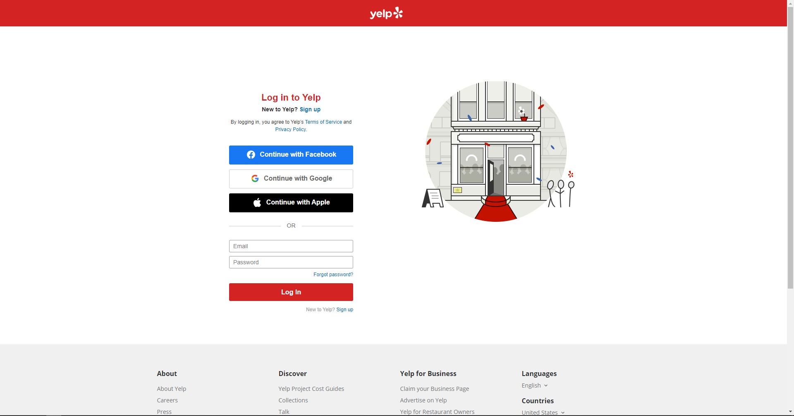
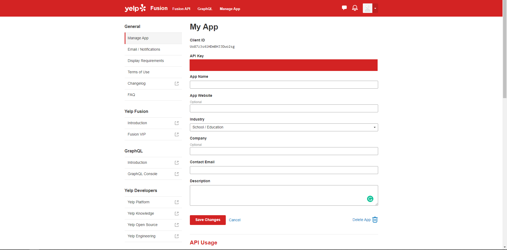
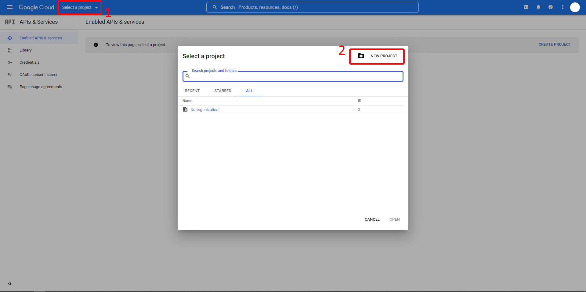
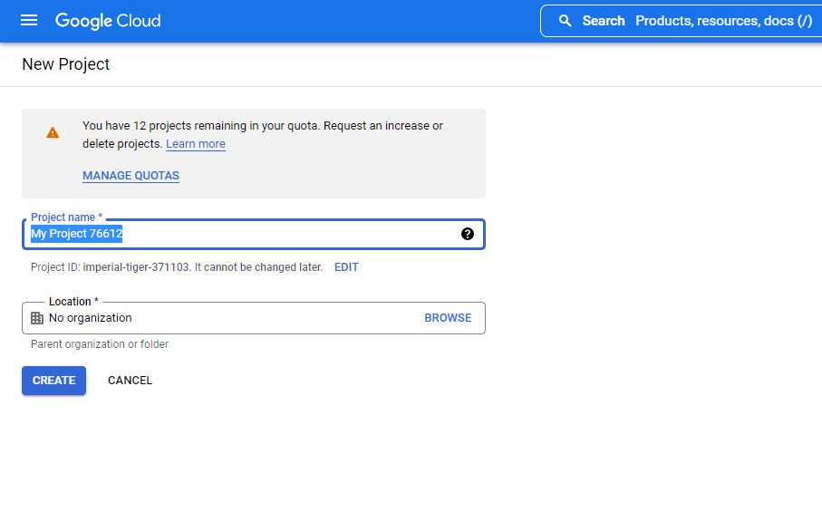
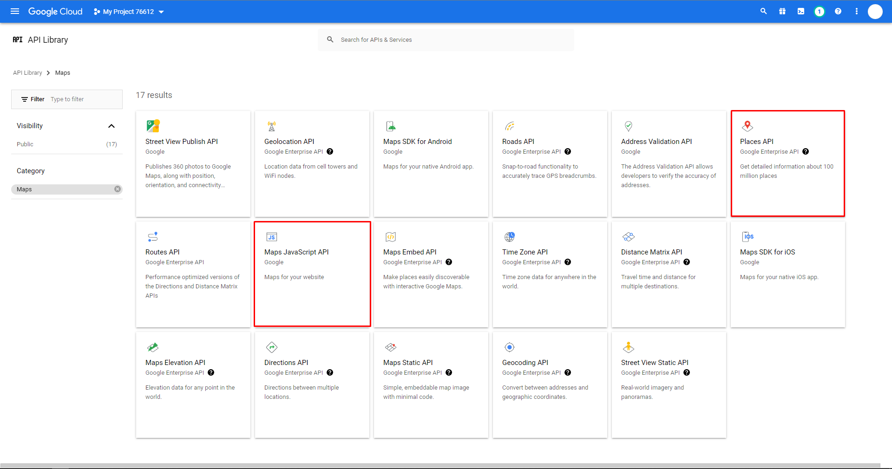
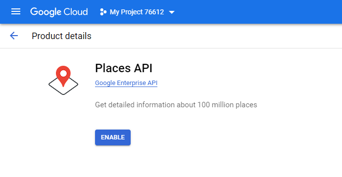
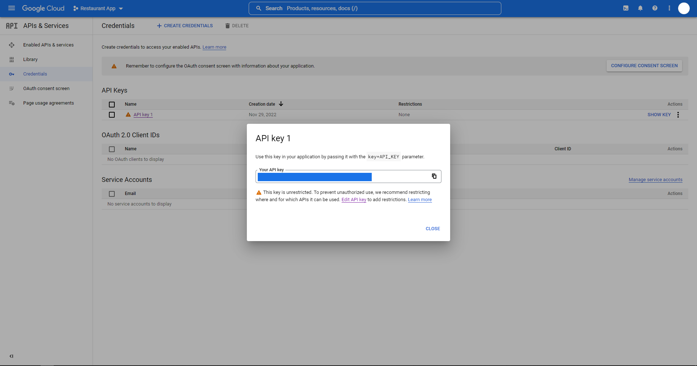

# Khaled Restaurant App

Restaurant finder application powered by Yelp and Google Maps.

## Create Virtual Enviroment & Install Dependencies

First, create your own virtual environtment by typing

```terminal
python -m venv .env
```

Next, install all the dependencies by reading the [requirements.txt](/requirements.txt) file using PIP

```terminal
pip install -r requirements.txt
```

## Get your own Yelp and Google Maps API

### Yelp API

1. Login/Sign Up to Yelp
   
2. Go to [Yelp for Developer](https://www.yelp.com/developers/v3/manage_app)
3. Register your App, fill some information there you can ignore the optional column
   
4. Copy the `API Key` and paste it in [settings.ini](/settings.ini) without quotation mark (replace the `***` with your `API Key`)
    ```
    [settings]
    YELP_KEY=***
    GOOGLE_MAPS_API=***
    SECRET_KEY=secret123
    ```

### Google API

1. Login to your Google Account
2. Go to [Google Developer Console](https://console.developers.google.com)
3. Create your project  
   select project, click on New Project
   
   Next, name your project and click create
   
4. Go to [libraries](https://console.cloud.google.com/apis/library/browse?filter=category:maps) and enable maps service (Maps JS API and Place API)
   
   Go to the library and then click enable
   

5. After everything was enabled, you can go to your [API credentials](https://console.cloud.google.com/apis/credentials), on the table with API Key click show key to see your API Key
   

6. Copy the `API Key` and paste it in [settings.ini](/settings.ini) without quotation mark (replace the `***` with your `API Key`)
    ```
    [settings]
    YELP_KEY=***
    GOOGLE_MAPS_API=***
    SECRET_KEY=secret123
    ```

## How to Run

```terminal
python manage.py runserver
```
